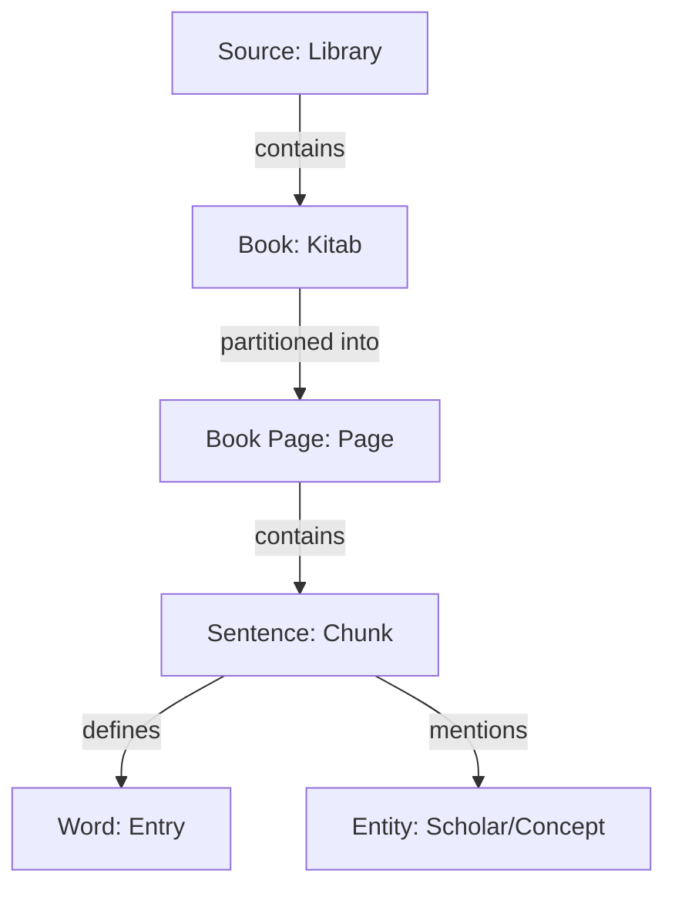

# Book Ingestion Documentation

## Analysis
The Book ingestion pipeline is the heavy-lifting component of the OpenBayan Knowledge Graph. It processes massive volumes of classical Islamic texts (Kitabs), dictionaries, and biographical works, converting flat text into structured graph data.

**Key characteristics:**
- **Granularity**: Data is ingested at the **Page** level (`book_page`), which serves as the raw container for digitized text.
- **Hybrid Extraction**: Large-scale extraction uses a combination of Regex (for structured entries in dictionaries like *Lisan al-Arab*) and LLM (Qwen2.5) for semantic understanding and entity extraction.
- **Graph Transformation**: The pipeline transforms `book_page` content into `sentence` (atoms) and `word` (linguistic nodes), linking them to `entity` and `root` records.
- **Utility**: Enables deep scholarly search, narrator network analysis (Rijal), and cross-referencing between classical texts and the Quran.

## Overview
The pipeline operates in three distinct phases: **Discovery**, **Ingestion**, and **Extraction**.

## Extraction Workflows

### 1. Source Discovery & Filtering
- **Script:** `shamela_hf_ingestion.py`
- **Data Source:** [ieasybooks-org/shamela-waqfeya-library](https://huggingface.co/ieasybooks-org)
- **Purpose:** Streams datasets from Hugging Face, filters by category (e.g., "التفاسير", "كتب اللغة"), and saves to local Parquet for optimized processing.

### 2. Record Ingestion (Raw Content)
- **Scripts:** `ingest_shamela_passages.py`, `ingest_athar_passages.py`
- **Purpose:** Populates the `book` and `book_page` tables with raw text and metadata.
- **Logic:** Maps external dataset IDs to internal `book_page` records, setting `processed_for_kg = false` for downstream extraction.

### 3. Knowledge Graph Extraction
- **Script:** `batch_dictionary_extraction.py`
- **Purpose:** The bridge to the Knowledge Plane. Processes pending `book_page` records.
- **Processing:**
    *   **Chunking**: Splits pages into ~350-word semantic chunks with overlap.
    *   **LLM Analysis**: Extracts `root`, `word`, `definition`, and `entities`.
    *   **Graph Creation**: Performs `RELATE` operations for `defines` and `mentions` edges.
    *   **Enrichment**: Fetches Wikipedia metadata for extracted entities.

## Current Status
As of the latest health check:
- **Total Books:** 4,661
- **Digitized Pages:** 83,915 (`book_page` table)
- **Dictionary Extraction:** ~0.72% complete (Ongoing phase to process 83k chunks).

## Data Example (Book Page)
A `book_page` record acts as the source for extraction:

```json
{
  "id": "book_page:passage_123",
  "content": "الصحبة: في اللغة المعاشرة، يقال صحبه يصحبه صحبة...",
  "source": "source:shamela_lisan_al_arab",
  "page_number": 45,
  "processed_for_kg": true
}
```

## Graph Schema
Books are modeled with a hierarchical structure leading down to semantic sentences.



## Monitoring
Execution logs are managed via Prefect. The `Batch Dictionary Extraction` flow logs progress every 1,000 records.
