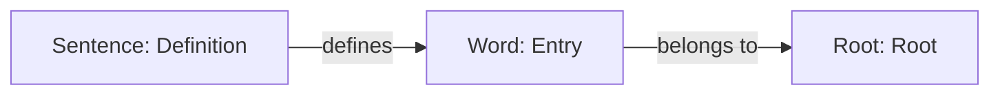

# MURAD Dataset Ingestion Documentation

## Analysis
The MURAD (Reverse Arabic Dictionary) dataset is a structured collection of Arabic terminology paired with contextual definitions and cross-references. 

**Key characteristics:**
- **Lexical Coverage:** Focuses on specialized terminology across various domains (e.g., machine learning, education, psychology).
- **Structure:** Records consist of a primary term (`word`), a descriptive definition (`definition`), and a reference ID (`ref`) likely linking to a source taxonomy.
- **Utility:** By mapping these terms and definitions into the knowledge graph, the system gains the ability to provide nuanced semantic explanations, link terms to their relevant academic fields, and ground LLM outputs in verified domain-specific terminology.

## Overview
The MURAD dataset is ingested into the knowledge graph to enrich the linguistic understanding of Arabic words and their definitions. The ingestion process leverages Prefect for orchestration and SurrealDB as the primary storage engine.

## Extraction Workflow
The ingestion logic is encapsulated in `OpenBayanBackend/notebooks/flows/ingest_murad.py`.

### 1. Data Source
- **File:** `data/murad/data/rd_dataset.csv`
- **Metadata:** Registered in SurrealDB under `source:murad_dataset_2026` ("MURAD Reverse Arabic Dictionary").

**Raw Data Example (CSV Row):**
```csv
word,definition,ref
الانتباه الذاتي,آلية تستخدم في نماذج التعلم الآلي مثل المحولات [التعلم العميق]، حيث يتم معالجة تفاعلات العناصر داخل بيانات التسلسل مع مراعاة كل عنصر بالنسبة لبقية العناصر.,4
```

### 2. Processing Pipeline
The flow follows a batch-processing pattern using `ThreadPoolTaskRunner` for concurrency:

1.  **Preparation**: Ensures the `source` record is initialized in the graph.
2.  **Batching**: Reads the CSV line-by-line and chunks records into batches of 50.
3.  **SurrealDB Ingestion** (per record):
    *   **Root & Word**:
        *   Extracts a root (using a 3-character fallback) and the word.
        *   `UPSERT`s the `root` and `word` nodes.
    *   **Definition (Sentence Node)**:
        *   **Embeddings**: Calls the configured Ollama instance (default `mxbai-embed-large:latest`) to generate vector representations of definitions.
        *   **De-duplication/ID**: Uses a MD5 hash of the definition text to generate a unique `sentence` record ID (`murad_{word}_{hash}`).
    *   **Relationship**:
        *   `RELATE`s the `sentence` (definition) to the `word` using the `defines` edge.

## Configuration
The following environment variables drive the pipeline:
- `SURREALDB_URL`: Connection string (default `ws://192.168.100.33:8000/rpc`)
- `OLLAMA_URL`: Embedding service URL
- `OLLAMA_EMBED_MODEL`: Model for definition vectorization

## Current Status
As of the latest health check:
- **Total Ingested Links (Words defined):** 96,221
- **Ingestion Source:** `source:murad_dataset_2026`

## Data Example
A typical record in the graph connects a definition (sentence) to a word.

**Example Query Result:**
```json
{
  "sentence": "امتداد فترة ملازمة الراوي للشيخ، وهو مصطلح يُستخدم في علم الحديث لوصف شروط الصحة للرواية [الحديث]",
  "word": "طُوْل الصُّحْبَة",
  "root": null
}
```

## Graph Schema
The MURAD data is modeled as a graph where sentences (definitions) define words, and words are linked to their respective roots.



## Related Scripts
The dictionary ingestion and enrichment ecosystem is managed by the following scripts located in `OpenBayanBackend/notebooks/flows/dictionary/`:

- `ingest_murad.py`: Primary ingestion pipeline for the MURAD dataset.
- `enrich_dictionary_data.py`: Orchestrates the linguistic enrichment of dictionary entries.
- `enrich_dictionary_data_remote.py`: Version of the enrichment flow designed for remote execution.
- `shamela_hf_ingestion.py`: Pipeline for ingesting library data from Hugging Face.
- `ingest_hf_enhanced_knowledge.py`: Ingestion logic for additional enhanced knowledge datasets.

## Monitoring
Execution logs are captured within Prefect. Progress milestones are logged every 1,000 processed records.
