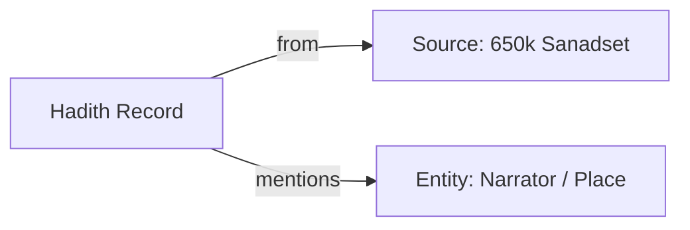

# Hadith Ingestion Documentation

## Analysis
The Hadith ingestion pipeline integrates a massive collection of prophetic traditions (Hadith) with their chains of narration (Sanad) and texts (Matn). 

**Key characteristics:**
- **Source Dataset:** `freococo/650k_sanadset` from Hugging Face.
- **Scope:** Approximately 650,000 Hadith records (though current database count reflects a partial or specific subset ingestion).
- **Structure:** Each record includes the collection name (e.g., Sahih Bukhari), Hadith number, the Arabic text (Matn), and the raw chain of narrators (Sanad).
- **Utility:** This data forms the backbone for **Isnad (Chain) Analysis** and **Rijal (Narrator) Research**. By storing the raw Sanad, the system can later parse and link individual narrators into a complex social graph.

## Overview
The Hadith ingestion is orchestrated via Prefect and processed using the Hugging Face `datasets` library in streaming mode to manage memory efficiency for large datasets.

## Extraction Workflow
The ingestion logic is located in `OpenBayanBackend/notebooks/flows/dictionary/ingest_hf_enhanced_knowledge.py`.

### 1. Data Source
- **Hugging Face Path:** `freococo/650k_sanadset`
- **Metadata:** Registered in SurrealDB under `source:hadith_650k_sanadset`.

**Example Record (Internal JSON):**
```json
{
  "Hadith": "...",
  "Book": "Sahih Bukhari",
  "Num_hadith": "1",
  "Matn": "إنما الأعمال بالنيات...",
  "Sanad": "حدثنا الحميدي عبد الله بن الزبير..."
}
```

### 2. Processing Pipeline
1.  **Source Initialization**: Ensures the `source:hadith_650k_sanadset` record exists.
2.  **Streaming**: Loads the dataset from Hugging Face using `streaming=True`.
3.  **Normalization**:
    *   Slugifies the "Book" (collection) name to ensure ASCII-safe record IDs.
    *   Escapes special characters in Matn and Sanad to prevent SurrealQL syntax errors.
4.  **Batching**: Groups 100 `UPSERT` statements into single transactions for performance.
5.  **Record ID Structure**: `hadith:{collection_slug}_{hadith_number}`.

## Current Status
As of the latest health check:
- **Total Ingested Hadiths:** 88,690
- **Primary Table:** `hadith`
- **Note:** Ingestion of the full 650k set may be ongoing or partially completed depending on the environment limits.

## Graph Schema
The `hadith` table is currently modeled as standalone records linked to a `source`. Future enrichment will link these to `entity` (Narrators) and `topic` (Classification).



## Monitoring
Execution logs are available in Prefect. Logs indicate progress every 100 batches (10,000 Hadiths).
