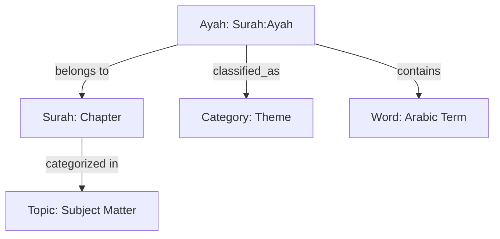

# Quran Ingestion Documentation

## Analysis
The Quran ingestion pipeline is a multi-modal data acquisition system that builds a rich, interconnected knowledge base for each Ayah. It combines primary Quranic text with multi-lingual translations, classical and modern Tafsirs, thematic annotations, and emotional sentiment analysis.

**Key characteristics:**
- **Layered Architecture:** The `ayah` table acts as the central hub, where subsequent ingestion flows append data (translations, tafsirs, metadata).
- **Multi-Source:** Integrates data from `api.alquran.cloud`, `api.quran.com`, and custom CSV datasets (e.g., Ronnie Aban's Indonesian metadata).
- **Graph Connections:** Beyond record storage, the pipeline creates graph edges (`classified_as`) linking Ayahs to thematic `category` nodes.
- **Utility:** This rich structure allows for multi-lingual search, cross-reference between Surahs, and AI-driven insights based on emotional and thematic context.

## Overview
The Quran ingestion is composed of several specialized Prefect flows, each responsible for a specific layer of the `ayah` data model.

## Extraction Workflows

### 1. Multi-Edition Ingestion (Global)
- **Script:** `ingest_quran_editions.py`
- **Data Source:** [AlQuran Cloud API](https://api.alquran.cloud/v1)
- **Purpose:** Ingests hundreds of text-based editions (Translations, Tafsirs, Transliterations).
- **Processing:** Downloads full editions and performs per-Surah batch updates to the `translations`, `tafsir`, or `transliterations` objects within the `ayah` records.

### 2. Scholarly Metadata (Indonesian)
- **Script:** `ingest_quran_ronnieaban_metadata.py`
- **Data Source:** `ronnieaban_quran.csv`
- **Purpose:** Adds extensive Indonesian scholarly metadata (Wajiz, Tahlili, Sabab Nuzul, Intro, Themes).
- **Graph Impact:** Creates `theme_*` categories and links them to Ayahs via `classified_as` edges.

### 3. Arabic Tafsir (Quran.com)
- **Script:** `ingest_quran_tafsir_qurancom.py`
- **Data Source:** [Quran.com API](https://api.quran.com/api/v4/tafsirs)
- **Purpose:** Specifically targets high-quality Arabic Tafsirs (e.g., As-Sa'di, Al-Mukhtasar).

### 4. Thematic & Emotional Analysis
- **Script:** `ingest_quran_thematic_emotional.py`
- **Data Source:** `quranic_thematic_emotional.csv`
- **Purpose:** Ingests annotations for `emotion`, `sentiment`, and `thematic_subgroup`.
- **Logic:** Merges metadata and strengthens thematic categorization with weighted relations.

## Current Status
As of the latest health check:
- **Central Record Count:** 6,236 Ayahs (100% of the Quran).
- **Thematic Categories:** 1,314 theme-based categories.
- **Classification Links:** 7,660 connections between Ayahs and themes.

## Data Example (Ayah Hub)
An `ayah` record serves as a JSON hub containing multiple nested layers:

```json
{
  "surah_number": 1,
  "ayah_number": 1,
  "text": "بِسْمِ اللَّهِ الرَّحْمَٰنِ الرَّحِيمِ",
  "translations": {
    "en_sahih": "In the name of Allah, the Entirely Merciful, the Especially Merciful.",
    "id_indonesian": "Dengan menyebut nama Allah Yang Maha Pemurah lagi Maha Penyayang."
  },
  "tafsir": {
    "ar_saddi": "...",
    "id_wajiz": "..."
  },
  "metadata": {
    "emotion": "mercy",
    "sentiment": "positive",
    "theme_group": "Basmalah"
  }
}
```

## Graph Schema
The Quran is integrated into the graph through record fields and explicit classification edges.



## Monitoring
Execution logs are managed via Prefect. Progress is typically tracked Surah-by-Surah (1-114).
