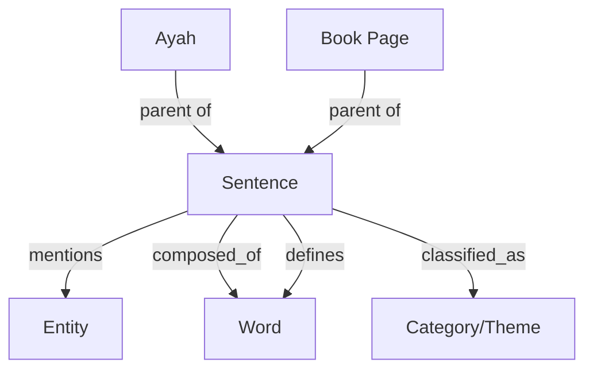

# Sentence (Knowledge Unit) Ingestion Documentation

## Analysis
The `sentence` table is the most critical component of the OpenBayan Knowledge Graph. It represents the **Atomic Unit of Knowledge**—the level at which search, cross-referencing, and semantic analysis occur.

**Key characteristics:**
- **Atomicity**: Large texts (Ayahs, Book Pages) are broken down into smaller, semantically coherent "sentences" or "chunks."
- **Hybrid Search Hub**: This table hosts both a BM25 Full-Text index and an HNSW Vector index (1024 dimensions via `mxbai-embed-large`), enabling powerful hybrid search.
- **Multimodal Linkage**: Every sentence is linked to its `parent` (the original verse or page) and its `source` (the specific edition or book).
- **Linguistic Connection**: Sentences are connected to the `word` table via `composed_of` relations and the `entity` table via `mentions` relations.

## Overview
Sentences are not ingested directly from external sources. Instead, they are the **output of transformation pipelines** that process core texts.

## Generation Workflows

### 1. Quranic Atomization
- **Logic Location:** `OpenBayanBackend/notebooks/ingest_quran.py`
- **Method:** **Regex-based Segmenting**. 
- **Trigger:** Uses Quranic Waqf (stop) marks (ۚ, ۗ, ۖ) to split long Ayahs into natural semantic breathing points.
- **Result:** Ayat al-Kursi (2:255), for example, is atomized into 9 distinct `sentence` records.

### 2. Scholarly & Dictionary Chunking
- **Logic Location:** `OpenBayanBackend/batch_dictionary_extraction.py`
- **Method:** **Recursive Arabic Chunker**.
- **Process:**
    1.  Splits `book_page` content into ~350-word blocks with a 15% overlap to preserve context.
    2.  An LLM (Qwen2.5) extracts the definitive dictionary entries from these chunks.
    3.  Each entry is saved as a `sentence` linked back to the page.

### 3. Enrichment (The Knowledge Plane)
Every `sentence` record undergoes a rigorous enrichment pipeline to transition from raw text to a structured knowledge unit:
- **Vectorization**: Call to Ollama for 1024-dim embeddings.
- **Categorization**: Each sentence is automatically classified into **Taxonomies** (Shamela taxonomy) and **Topics** (Thematic categories) to enable hierarchical browsing.
- **Entity Extraction**: LLM identifies people, places, and concepts, creating `mentions` links to the `entity` table.
- **Relationship Mapping**: The system identifies connections between entities within the sentence, populating the `entity_relation` table.
- **Linguistic Mapping**: Linking the text to Arabic `roots` and `words` via the `composed_of` and `defines` relations.

## Current Status
As of the latest health check:
- **Total Sentence Atoms:** 120,907
- **Primary Source:** ~80% of current atoms are derived from the **MURAD** dataset.
- **Search Readiness:** Fully indexed for keyword and semantic search.
- **Note:** Ingestion for Quranic and Hadith atoms is in its early stages; the bulk of the `ayah` and `hadith` tables has not yet been processed into the `sentence` plane.

## Ingestion Roadmap
The transition to the Sentence (Atomic) unit follows a prioritized sequence:

1.  **Phase 1: MURAD (Active)**: Ingesting specialized linguistic terms and definitions.
2.  **Phase 2: Quran (Starting)**: Regex-based atomization of 6,236 Ayahs into semantic chunks.
3.  **Phase 3: Hadith (Planned)**: Breaking down the sanadset into individual narration units and matn chunks.
4.  **Phase 4: Books (Advanced)**: Massive-scale chunking of classical digitized pages (83k+ pages).

## Data Example (Sentence Atom)
```json
{
  "id": "sentence:dict_mura_12345",
  "text": "الصحبة: في اللغة المعاشرة، يقال صحبه يصحبه صحبة",
  "parent": "book_page:passage_abc",
  "source": "source:murad_dataset_2026",
  "embedding": [0.12, -0.05, ...],
  "chunk_index": 0,
  "mention_count": 5
}
```

## Graph Schema (The Atom Hub)


## Monitoring
Execution progress for sentence generation is tracked within the specific parent pipeline (e.g., Quran Ingestion or Batch Extraction).
