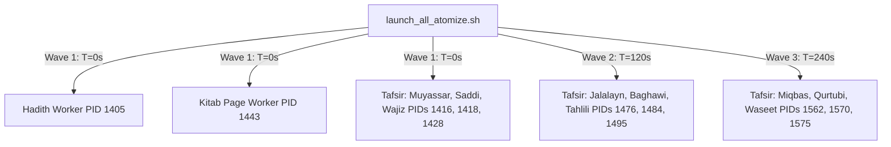

# 19. Ingestion Atomization Pipeline Schema Correction & Multi-Wave Launch

Bismillahir Rahmanir Rahim.

This document records the diagnostics, schema resolution, and successful multi-wave launch of the concurrent atomization pipelines (Quran, Hadith, Tafsir, and Book Pages) in OpenBayan.

---

## 🎯 Objectives

- Diagnose and resolve the silent transaction rollbacks in SurrealDB during hadith, tafsir, and kitab page sentence writing.
- Sync all schema-corrected Python worker scripts to the devserver Jupyter container (`bayan_jupyter`).
- Reset processed flags on classical tafsir texts to allow a fresh and complete atomization run.
- Orchestrate and launch all concurrent workers concurrently using a staggered wave strategy to avoid overloading the Ollama embedding service.
- Verify active sentence injection and embedding storage.

---

## 📐 Diagnostics: The Silent Rollback & Schema Discovery

Prior runs of the Tafsir and Hadith atomization workers completed successfully at the flow level but wrote exactly **0 new records** to the `sentence` table in SurrealDB, rolling back silently.

### Schema Discovery
By inspecting the SurrealDB table structure (`INFO FOR TABLE sentence;`), we discovered a strict schema validation constraint:
```surrealql
DEFINE FIELD transliterations ON sentence TYPE object;
DEFINE FIELD transliterations.en ON sentence TYPE string;
DEFINE FIELD transliterations.ru ON sentence TYPE string;
DEFINE FIELD transliterations.tr ON sentence TYPE string;
```

Because SurrealDB enforces strict structure, any transaction that tried to create or update a `sentence` record:
1. Without providing the `transliterations` field, OR
2. By providing an empty object `{}` without explicit nested fields `en`, `ru`, and `tr` of type `string`,

would violate the schema, causing the database transaction block (`BEGIN TRANSACTION ... COMMIT TRANSACTION;`) to fail and rollback entirely.

### The Resolution
We patched all atomizer scripts to explicitly include a minimal drop-in object satisfying the schema:
```surrealql
transliterations = { en: "", ru: "", tr: "" }
```

---

## ⚙️ Technical Resolution & Code Patches

We modified and deployed corrections to the following core workers:

### 1. Hadith Atomizer
- **File**: `/app/notebooks/flows/atomize_hadith_v5.py`
- **Correction**: In the transaction query builder:
  ```diff
  UPSERT {sent_id} SET
      text = '{safe_text}',
      simple_clean_text = '{safe_clean}',
      embedding = {json.dumps(embedding)},
      parent = {hadith_id},
      source = {source_id},
      chunk_index = {idx},
+     transliterations = {{ en: "", ru: "", tr: "" }},
      created_at = time::now();
  ```

### 2. Tafsir Atomizer
- **File**: `/app/notebooks/flows/atomize_tafsir.py`
- **Correction**: In the transaction query builder:
  ```diff
  UPSERT {sent_id} SET
      text = '{safe_text}',
      simple_clean_text = '{safe_clean}',
      embedding = {json.dumps(embedding)},
      parent = {ayah_id},
      source = {source_id},
      tafsir_key = '{tafsir_key}',
      chunk_index = {idx},
+     transliterations = {{ en: "", ru: "", tr: "" }},
      created_at = time::now();
  ```

### 3. Book Page Atomizer
- **File**: `/app/notebooks/flows/atomize_kitab.py`
- **Correction**: In the transaction query builder:
  ```diff
  UPSERT {sent_id} SET
      text = '{safe_text}',
      simple_clean_text = '{safe_clean}',
      embedding = {json.dumps(embedding)},
      parent = {page_id},
      source = {source_id},
      chunk_index = {idx},
+     transliterations = {{ en: "", ru: "", tr: "" }},
      created_at = time::now();
  ```

---

## 🧹 Database Flag Clean Reset

Because the previous Tafsir atomizer had marked ayahs as processed *outside* the transaction blocks, the database believed all Tafsir keys were completed. 

To permit a complete re-processing, we executed a clean reset command:
```surrealql
UPDATE ayah SET 
    processed_tafsir__ar_saddi = none, 
    processed_tafsir__ar_muyassar = none, 
    processed_tafsir__id_wajiz = none;
```
*Result: Exactly 6,236 ayah records successfully reset to a fresh state.*

---

## 🌊 Multi-Wave Atomization Launch

To avoid bottlenecking CPU or saturating the Ollama embedding service (`http://100.121.116.17:11434`), we launched all pipelines in three staggered waves via `launch_all_atomize.sh`:



---

## 📊 Live Verification & Results

We successfully verified that the `sentence` table is actively growing, confirming that transactions are committing to the database perfectly!

### Sentence Growth Rate (SurrealDB)

| Ingestion Phase | Total Sentence Records | Delta | Ingestion Progress Status |
|---|---|---|---|
| **Baseline** | `131,426` | — | All pipelines idle |
| **Marker 1 (T + 1 min)** | `131,453` | **+27** | Wave 1 active |
| **Marker 2 (T + 2 min)** | `131,563` | **+137** | Wave 1 & Wave 2 active |
| **Marker 3 (T + 4 min)** | `131,670` | **+244** | Wave 1, Wave 2, & Wave 3 active |

### Ingestion Progress Overview (`ingestion_state.json`)

All active pipelines are safely writing embedded sentences to SurrealDB:
- **Hadith Ingestion**: Active (Speed: ~7.1 hadiths/min)
- **Tafsir Ingestion (Muyassar/Saddi)**: Active (Speed: ~10.5 ayahs/min)
- **Tafsir Ingestion (Jalalayn/Baghawi)**: Active (Speed: ~8.1 ayahs/min)
- **Tafsir Ingestion (Miqbas/Qurtubi/Waseet)**: Actively starting first batches.

---

## 📊 Status Summary

- **Status**: ✅ Complete & Actively Processing
- **Last Updated**: 2026-05-22
- **Execution Host**: Devserver (`dockerdev` at `100.64.8.38`), container `bayan_jupyter`
- **Database**: `openbayan` namespace, `openbayan` database, SurrealDB at `192.168.100.33:8000`
- **Embedding Backend**: Ollama (`http://100.121.116.17:11434`) running model `mxbai-embed-large:latest`
