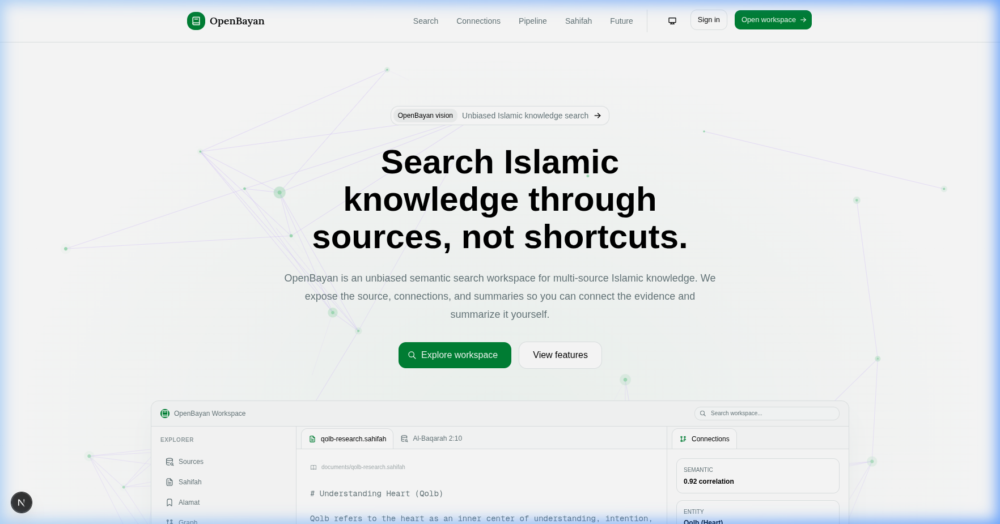
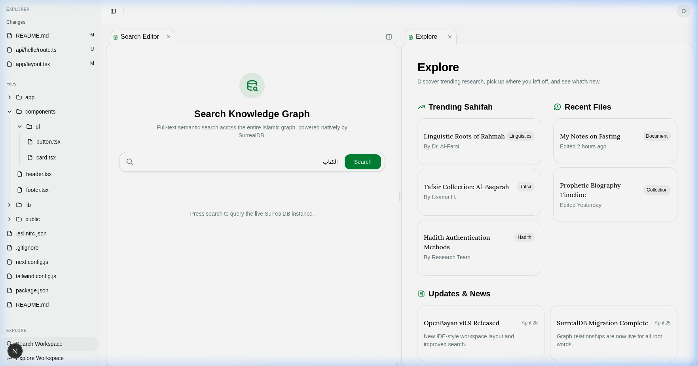
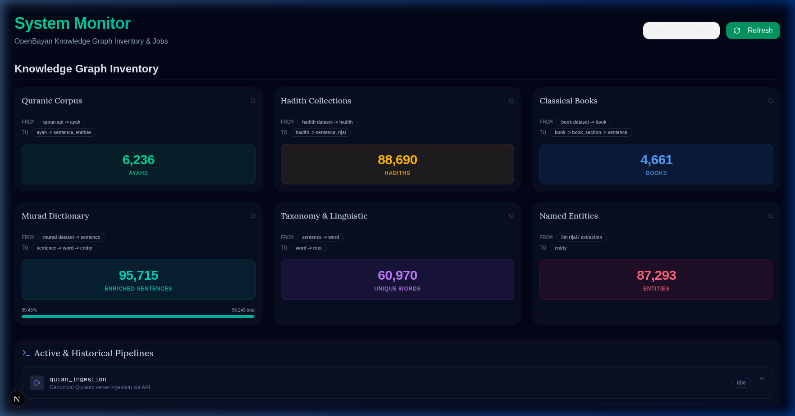
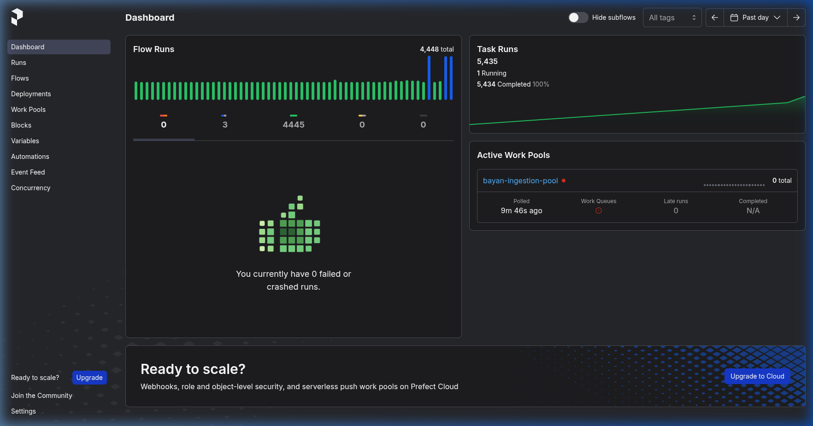
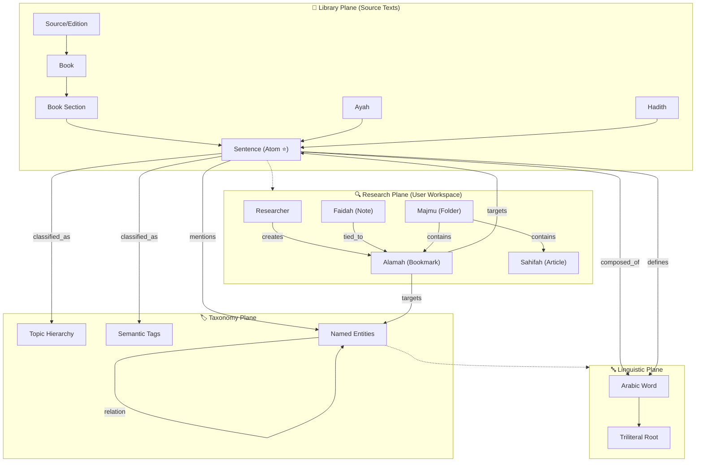

# OpenBayan: The Islamic Knowledge Graph

OpenBayan is a specialized "Minimal AI Stack" designed for multi-source Islamic research. It leverages a multi-model Knowledge Graph to connect Quranic verses, Hadith narrations, and classical scholarly works.



## 🎯 Current Condition (May 2026)

The project has transitioned from foundational infrastructure to active data enrichment. The Knowledge Graph is currently live on the **Devserver (Tailscale: 100.64.8.38)** with the following metrics:

| Domain | Status | Count | Note |
| :--- | :--- | :--- | :--- |
| **Quranic Corpus** | ✅ 100% | 6,236 Ayahs | Full Uthmani text with multi-source Tafsir. |
| **Hadith Collections** | 🔄 Enriched | 88,690 Hadiths | Major collections (Bukhari, Muslim) integrated. |
| **Classical Books** | 🔄 Ingesting | 4,661 Books | Active ingestion of the Shamela library. |
| **Linguistic Graph** | 🔄 Active | 95,715 Sentences | Enriched via Murad Reverse Arabic Dictionary. |
| **Named Entities** | 🔄 Growing | 87,293 Entities | Mapped Narrators (Rijal) and Semantic Roots. |

### Active Focus:
- **Hybrid Search Strategy**: Combining Vector (Semantic) and BM25 (Keyword) search via SurrealDB.
- **Research Workspace**: Consolidating the IDE-style editor for scholarly research.
- **Linguistic Augmentation**: Finalizing dictionary root extraction and verbatim transliteration.

---

## 🖼️ Project Gallery

### 1. Research Workspace (Editor)
The scholar's IDE for exploring connections across the Islamic graph. It features a split-pane view for source text, semantic correlation, and entity metadata.


### 2. Knowledge Graph Inventory (Monitoring)
Real-time dashboard tracking the density and growth of nodes across the Library Plane.


### 3. Pipeline Orchestration (Prefect)
Backend monitoring for high-concurrency ingestion and AI enrichment jobs.


## 🧠 Knowledge Graph Architecture

OpenBayan's intelligence lies in its multi-plane architecture, where immutable sacred texts are connected to dynamic scholarly research and linguistic analysis.



---

## 1. The Monorepo Structure

Everything lives in a single repository divided into two main domains.

```text
OpenBayan/                    # Root Repository
│
├── openbayan/                # Next.js + React + NextAuth
│   ├── package.json
│   ├── app/                  # App Router pages and route handlers
│   ├── components/           # Scholar UI components
│   ├── lib/                  # SurrealDB auth/query helpers
│   └── .env.local            # NextAuth and server-side SurrealDB settings
│
└── OpenBayanBackend/         # ⚙️ DOCKER & AI FACTORY
    ├── docker-compose.yml    # The Minimal AI Stack (SurrealDB, Prefect, Worker)
    ├── .env                  # Backend secrets (Prefect keys, Surreal root pass)
    ├── data/                 # (Ignored in Git) Persistent SurrealDB storage
    │
    ├── worker/               # 🐍 THE PYTHON WORKER ENVIRONMENT
    │   ├── Dockerfile        # Builds the Prefect 3.x Conda + Python 3.12 image
    │   └── requirements.txt  # surrealdb, transformers, spacy, camel-tools
    │
    └── notebooks/            # 🧠 THE AI PIPELINE CODE (Mapped via Docker Volume)
        ├── main_pipeline.py  # Prefect @flow definitions
        └── tasks/
            ├── prep.py       # SpaCy segmentation, Harakat stripping
            └── enrich.py     # SurrealQL relation queries, Vector embeddings
```

---

## 2. Service Communication Map

### A. The Ingestion Flow (Backend to Backend)
Inside the Docker `bayan_network`, services communicate securely using internal hostnames.

*   **Data Worker ➔ Prefect Server**:
    *   **Protocol**: HTTP (REST)
    *   **Address**: `http://prefect-server:4200/api`
    *   **Purpose**: The Worker polls Prefect for jobs and sends logs back.
*   **Data Worker ➔ SurrealDB**:
    *   **Protocol**: WebSockets (`ws://`) via SurrealDB Python SDK.
    *   **Address**: `ws://surrealdb:8000/rpc`
    *   **Auth**: Root credentials from `docker-compose.yml`.
    *   **Purpose**: Executes SurrealQL queries for Knowledge Graph and Vector indexing.

### B. The User Flow (Frontend to Backend)
Communication over the public network or localhost.

*   **React Frontend ➔ NextAuth**:
    *   **Protocol**: HTTP (OAuth2)
    *   **Purpose**: Handles login (e.g., Quran.com OIDC) and establishes user sessions.
*   **Next.js Server Routes ➔ SurrealDB**:
    *   **Protocol**: HTTP SQL or WebSocket RPC.
    *   **Address**: `http://host.docker.internal:8000` from the frontend container.
    *   **Auth**: Uses SurrealDB record tokens stored in the NextAuth session.
    *   **Purpose**: Hybrid search, graph exploration, and authenticated user data access.

---

## 3. Port & Network Summary

| Port | Service | Access Level | Purpose |
| :--- | :--- | :--- | :--- |
| **3000** | Next.js Frontend | Public (Browser) | The React application UI. |
| **8000** | SurrealDB | Public (API/WS) | Direct queries from React frontend. |
| **4200** | Prefect UI | Admin Only | Dashboard to monitor AI pipelines. |
| **(None)** | Data Worker | Internal Only | Outbound only to Prefect and SurrealDB. |

---

## 4. The Auth Bridge (NextAuth ➔ SurrealDB)

OpenBayan bridges NextAuth directly to SurrealDB to eliminate unnecessary backend middleware.

1.  **The Login**: User logs in via NextAuth.
2.  **The Token**: NextAuth issues a JWT with the user's ID and role.
3.  **The Handshake**: React code initializes the database:
    ```javascript
    import { Surreal } from 'surrealdb.js';
    const db = new Surreal();
    async function connectToDB(sessionToken) {
        await db.connect('ws://localhost:8000/rpc');
        await db.authenticate(sessionToken); 
    }
    ```
4.  **Database Security**: SurrealDB enforces row-level permissions:
    ```surrealql
    DEFINE TABLE notebooks PERMISSIONS FOR select WHERE user_id = $auth.id;
    ```

---

## 5. Credits & Data Sources

OpenBayan is built upon the invaluable work of the global Islamic research and open-source community. We gratefully acknowledge the following data sources, datasets, and APIs that power the OpenBayan Knowledge Graph:

### 📖 Quran & Tafsir (Exegesis)
*   **[Al Quran Cloud API](https://alquran.cloud/)**: Primary source for canonical Quranic text (Uthmani), translations, and audio metadata.
*   **[Quran.com API (v4)](https://quran.com)**: For scholarly Tafsir data (Ibn Kathir, Al-Jalalayn, etc.) and Islamic knowledge endpoints.
*   **[TafsirWeb](https://tafsirweb.com)**: For comprehensive Indonesian Tafsir sources including *Tafsir Kemenag (Tahlili/Wajiz)* and *Tafsir Al-Muyassar*.
*   **[MohamedRashad/Quran-Tafseer](https://huggingface.co/datasets/MohamedRashad/Quran-Tafseer)**: A massive collection of classical Arabic interpretations.
*   **[Fawaz Ahmed's Quran API](https://github.com/fawazahmed0/quran-api)**: Providing a wide range of Quranic editions and translations.
*   **[QuranJSON (penggguna)](https://github.com/penggguna/QuranJSON)**: Clean JSON structures for Indonesian translations.

### 🧠 Thematic & Semantic Mapping
*   **[Ronnie Aban (ronnieaban)](https://github.com/ronnieaban)**: For Quranic thematic metadata, theme categories, and structural JSON collections.
*   **[Nabeel Qureshi](https://github.com/nabeelqureshi)**: For foundational thematic annotations and Ayah-to-Topic linking strategies.
*   **[ShahamFarooq/quran-bil-quran-connections](https://huggingface.co/datasets/ShahamFarooq/quran-bil-quran-connections)**: For Ayah-to-Ayah cross-reference mapping (Quran explaining Quran).

### 📜 Hadith & Sanad (Isnad)
*   **[Sanadset (freococo)](https://huggingface.co/datasets/freococo/650k_sanadset)**: A monumental dataset of 650,000+ hadith narrations and sanad (narrator chains).
*   **[meeAtif/hadith_datasets](https://huggingface.co/datasets/meeAtif/hadith_datasets)**: For standardized collections of *Kutub al-Sittah*.
*   **[Slepovichev/hadith-14-books](https://huggingface.co/datasets/Slepovichev/hadith-14-books-collection)**: Broad collection covering 14 classical books of Hadith.

### 📚 Linguistic & Dictionary
*   **[MURAD Reverse Arabic Dictionary](https://github.com/RIOTU-Lab)**: Provided by **RIOTU Lab**, serving as the foundation for our reverse-semantic search.
*   **[Shamela Library (ieasybooks-org)](https://huggingface.co/ieasybooks-org)**: For digitized collections of the *Shamela Waqfeya* library, including classical dictionaries like *Lisan al-Arab* and *Al-Qamus al-Muhit*.
*   **[CAMeL Tools](https://github.com/CAMeL-Lab/camel_tools)**: For essential Arabic NLP, morphological analysis, and lemmatization.

### 🛠️ Technical Stack
*   **[SurrealDB](https://surrealdb.com)**: The Multi-Model Knowledge Graph database.
*   **[Prefect](https://prefect.io)**: Our orchestration engine for data ingestion and AI pipelines.
*   **[Next.js](https://nextjs.org)** & **[NextAuth.js](https://nextauth.js.org)**: Powering our frontend and auth bridge.

Special thanks to the developers, researchers, and scholars who maintain these resources for the benefit of the Ummah. *Jazakumullahu Khayran.*

---
