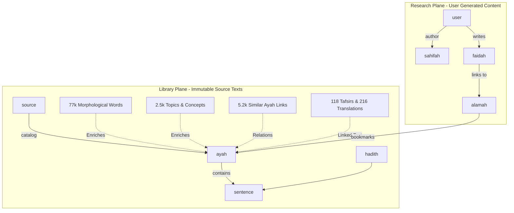

# Tarteel QUL (Quranic Universal Library) Resources & Tools
## Integration Guide & Future Improvements for OpenBayan Knowledge Graph

This document details the developer tools and rich data resources available on [Quranic Universal Library (QUL) by Tarteel AI](https://qul.tarteel.ai), and outlines how we can leverage them to expand and enrich the **OpenBayan Semantic Knowledge Graph** in SurrealDB.

---

## 1. Overview of QUL Tools

Tarteel QUL provides a suite of collaborative editing, proofreading, and data-curation tools designed to maintain the highest standard of digital Quranic data. These tools are invaluable references for how we can structure user-facing validation workflows or ingestion pipelines.

### Available Tools Catalog

| Tool Name | Description | Potential In OpenBayan |
| :--- | :--- | :--- |
| **Mushaf Layouts Editor** | Proofread and correct line-by-line and page-by-page word alignment layouts (15-line, 16-line, v1, v2). | Can be used as a blueprint for implementing our custom Next.js Mushaf layout viewer. |
| **Tajweed Rules Annotation** | Review and correct embedded Tajweed rules (e.g., color-coding, rule classifications) in the Quranic text. | Helps build clean Tajweed models, ensuring accurate color rendering on the frontend. |
| **Surah & Ayah Audio Segments** | Interactive waveform editors for word-by-word audio timestamp alignment. | Reference for how we can build/integrate word-level audio synchronization in our frontend. |
| **Translation & Tafsir Proofreading** | Community-driven interface to proofread, edit, and flag translation/tafsir issues in multiple languages. | Example of Research Plane curation; we can support similar community feedback mechanisms. |
| **Quranic Script & Fonts Proofreader** | Flags tashkeel and rendering compatibility issues across various custom fonts. | Extremely useful for testing custom font compatibility in the OpenBayan Next.js frontend. |
| **Word-by-Word Translation & Transliteration** | Tools to review and suggest micro-level translation mappings for every word of the Quran. | Can be used to verify morphological and grammatical meanings in the Library Plane. |
| **Concordance Labeling of Words** | A tool to label the grammar, parts of speech, and morphology of individual Quranic words. | Critical resource for enriching morphological graph nodes and linguistic facts. |
| **Ayah Dependency Graphs** | A visual dependency tree editor mapping grammatical relationships between words in an Ayah. | Deep semantic grammar parsing. High value for generating graph edges in our NLP/KG pipelines. |
| **Text & Font Compatibility Checker** | Analyzes Unicode values and previews text compatibility across diverse scripts (Madani, IndoPak, etc.). | Reference for font debugging. |

---

## 2. Overview of QUL Downloadable Resources

Tarteel QUL offers a treasure trove of clean, structured datasets in formats like SQLite, JSON, and CSV. These can be ingested into our **Library Plane** to make OpenBayan the most comprehensive Quranic research engine.

### Available Datasets & Counts

1. **Recitations and Segments Data** (130 Reciters): Includes 71 unsegmented and 59 word-by-word segmented audio profiles with precise timings.
2. **Mushaf Layouts** (28 Layouts): Page/line layout configurations for various printed mushafs.
3. **Translations** (216 Translations): 200 ayah-by-ayah translations in multiple languages, plus 16 highly detailed word-by-word translation matrices.
4. **Tafsirs** (118 Tafsirs): 35 concise (Mukhtasar) and 83 detailed (detailed classical and modern) commentaries with ayah grouping intelligence.
5. **Quran Scripts** (28 Scripts): Clean Unicode text and glyph variations for IndoPak, Uthmani, and Tajweed-enriched Uthmani scripts.
6. **Quran Fonts** (19 Fonts): Custom-curated glyph packages for high-fidelity web rendering.
7. **Quran Metadata** (8 Datasets): Essential mapping data for surah, ayah, juz, hizb, rub, manzil, and page markers.
8. **Transliteration** (9 Datasets): Ayah-by-ayah and word-by-word phonetic transliterations in Latin script.
9. **Surah Information** (9 Datasets): Detailed surah background context, revelation periods (Makki/Madani), and core themes in multiple languages.
10. **Topics and Concepts in the Quran** (2,512 Topics): Hierarchical concept mapping detailing semantic relations between topics (e.g., Prophets, Creed, Pillars, History).
11. **Quranic Grammar and Morphology** (77,432 Words): Highly detailed morphology database containing lemma, stem, roots, prefix/suffix markers, and parts of speech for every single word in the Quran.
12. **Mutashabihat ul Quran** (5,277 matches): Similarity mappings in terms of wording, context, and semantic equivalence.
13. **Similar Ayahs** (4,001 entries): Word similarity mappings, allowing deep inter-verse semantic navigation.
14. **Ayah Theme** (1,049 entries): Categorizes verses under overarching thematic chapters.

---

## 3. Alignment with OpenBayan SurrealDB Database Planes

According to our architectural standard defined in `GEMINI.md` and `DATABASE.md`, all imported resources must strictly go to the **Library Plane (Immutable Source Texts)**, while any community corrections or user notes belong in the **Research Plane**.

### Proposed Mapping Rules for SurrealDB

1. **Translations & Tafsirs (`source` + `book` + `book_section` / `book_page`):**
   - Each translation/tafsir is registered as an immutable `source` or `book` in the Library Plane.
   - Chunks or verses are linked directly to `ayah` using SurrealDB graph relations (e.g., `translation_of` or `tafsir_of`).

2. **Quranic Grammar & Morphology (`sentence` + `ayah`):**
   - Import the 77,432 morphological breakdowns. Each word can be treated as a node, linked to its parent `ayah` node.
   - Create semantic relations like `ayah -> has_word -> word`, and `word -> has_root -> root`.
   - This enables powerful morpho-semantic queries (e.g., *Find all verses where a word with root 'K-T-B' is used as a active participle (Ism Fa'il)*).

3. **Topics & Concepts (`concept` nodes + graph relations):**
   - Ingest the 2,512 topics as hierarchical concept nodes in the Library Plane.
   - Establish semantic relations like `concept:iman -> child_of -> concept:aqeedah` and `ayah:2_255 -> speaks_about -> concept:tauheed`.

4. **Mutashabihat & Similar Ayahs (`similarity_edge` graph relations):**
   - Create direct graph edges in SurrealDB: `ayah:2_2 -> mutashabih_with { similarity_type: "verbal", shared_words: [...] } -> ayah:3_2`.
   - This builds an instant, high-speed, structural similarity sub-graph within OpenBayan.

---

## 4. Ingestion & Enrichment Roadmap (Future Improvements)

All future data-processing and ingestion jobs must run as **Prefect tasks and flows** on our remote Devserver (`dockerdev` at 100.64.8.38).

### Step 1: Resource Scraper & Archiver (Prefect Flow)
- Build a Prefect flow to safely fetch QUL database releases (SQLite files/JSON packages) via the Github API/releases or the QUL direct static storage.
- Archive the raw assets in the production environment.

### Step 2: Morpho-Semantic Graph Ingestion Flow
- Design a modular Python script inside `OpenBayanBackend/notebooks/flows/` to read the SQLite database of QUL morphology.
- Parse the tables and write a bulk SurrealDB insertion script that generates:
  - `word` records.
  - Root relationships (`root` nodes and `derived_from` edges).
  - Part-of-speech mappings.

### Step 3: Quranic Topics & Concept Hierarchy Ingestion
- Map the hierarchical topic structure into a clean graph index in SurrealDB.
- Connect the concepts with semantic edges to support semantic search algorithms.

### Step 4: Tajweed & Page Layout Metadata Integration
- Incorporate QUL's page layouts (15/16 lines) directly into the Next.js visual components to offer standard Mushaf page modes matching classical standards.

---

## 5. Summary of Actions
- [x] Analyze `https://qul.tarteel.ai/tools` and `https://qul.tarteel.ai/resources`.
- [x] Create comprehensive documentation aligning the resources with OpenBayan database planes.
- [ ] Schedule automatic reminder to review this document later with the user.
